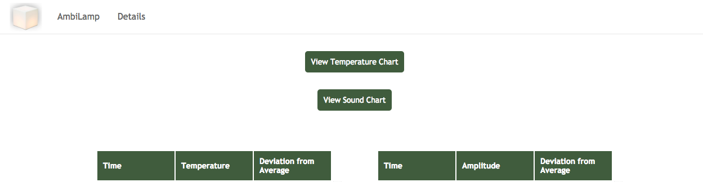

# IoT_WeatherBox
Internet of Things (IoT) application that can collect weather data including humidity and temperature  through sensors, store data in backend servers, and reflect weather data on webpages instantaneously using JavaScript, PHP, MongoDB, python, and HTML/CSS.

